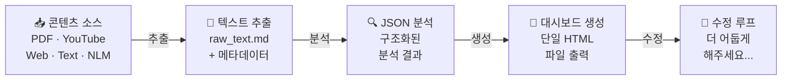

<div align="center">

# Content Dashboard Agent

**어떤 콘텐츠든, 인터랙티브 HTML 대시보드로 변환합니다.**

PDF · 텍스트 파일 · YouTube 영상 · 웹페이지 · NotebookLM 노트북

[English README](README.md)

<br>


</div>

<br>

> **참고:** 이 프로젝트는 독립 실행형 앱이나 CLI가 아닙니다. **Claude Code 에이전트 시스템**의 작업 레포지토리입니다 — 오케스트레이션 지시, 추출 스크립트, 분석 규칙, 대시보드 생성 레퍼런스가 포함되어 있습니다.

---

## 라이브 예시

Content Dashboard Agent가 만드는 결과물을 직접 확인하세요. 각 링크는 단일 HTML 파일로 생성된 대시보드입니다.

<table>
<tr>
<th width="150">콘텐츠 유형</th>
<th width="300">English</th>
<th width="300">한국어</th>
</tr>
<tr>
<td><strong>📖 책 요약</strong></td>
<td><a href="https://codepen.io/Kipeum-Lee/full/JoKJEYX">View Dashboard →</a></td>
<td><a href="https://codepen.io/Kipeum-Lee/full/azvzbxE">대시보드 보기 →</a></td>
</tr>
<tr>
<td><strong>🎬 YouTube 영상</strong></td>
<td><a href="https://codepen.io/Kipeum-Lee/full/jEbErrj">View Dashboard →</a></td>
<td><a href="https://codepen.io/Kipeum-Lee/full/ZYpEKRX">대시보드 보기 →</a></td>
</tr>
<tr>
<td><strong>📄 논문</strong></td>
<td><a href="https://codepen.io/Kipeum-Lee/full/MYwNmMb">View Dashboard →</a></td>
<td><a href="https://codepen.io/Kipeum-Lee/full/emNqWwv">대시보드 보기 →</a></td>
</tr>
<tr>
<td><strong>📊 종합 분석</strong></td>
<td><a href="https://codepen.io/Kipeum-Lee/full/JodqRME">View Dashboard →</a></td>
<td><a href="https://codepen.io/Kipeum-Lee/full/Eajzgoy">대시보드 보기 →</a></td>
</tr>
<tr>
<td><strong>⚖️ 판례</strong></td>
<td><a href="https://codepen.io/Kipeum-Lee/full/qEdgWgO">View Dashboard →</a></td>
<td><a href="https://codepen.io/Kipeum-Lee/full/xbGMKMb">대시보드 보기 →</a></td>
</tr>
</table>

---

## 작동 방식



### 파이프라인

| 단계 | 수행 내용 | 담당 |
|:----:|-----------|------|
| **1** | 소스(파일 또는 URL) 제공 및 레이아웃 선택 | 사용자 |
| **2** | 텍스트 추출 및 정규화 | `content-ingestion` 스크립트 |
| **3** | 콘텐츠 유형, 테마, 레이아웃 자동 결정 | 오케스트레이터 (`CLAUDE.md`) |
| **4** | 소스를 구조화된 JSON으로 분석 | `content-analyzer` 서브 에이전트 |
| **5** | JSON을 인터랙티브 대시보드로 렌더링 | `web-content-designer` 스킬 |
| **6** | 자연어로 수정 요청 (횟수 제한 없음) | 수정 루프 |

---

## 지원하는 소스

| 소스 | 입력 방식 | 추출 내용 |
|------|-----------|-----------|
| **PDF** | `input/` 폴더에 파일 배치 | 전체 텍스트 (텍스트 레이어 포함 시 최상) |
| **텍스트** | `input/`에 `.md` 또는 `.txt` | 원본 내용 그대로, 언어 보존 |
| **YouTube** | URL 직접 전달 | 자막 + 타임스탬프 + 영상 메타데이터 |
| **웹페이지** | URL 직접 전달 | 본문 추출, 보일러플레이트 제거 |
| **NotebookLM** | 노트북 URL | 소스 전문 + notebooklm-py 통한 Study Guide |

---

## 콘텐츠 인식 출력

대시보드는 콘텐츠 유형에 따라 구조가 달라집니다:

| 콘텐츠 유형 | 최적화 대상 |
|:----------:|-------------|
| `book` | 챕터 네비게이션, 표지 이미지, 섹션별 분석 |
| `paper` | 초록, 연구방법, 결과, 논의 구조 |
| `media` | 타임스탬프 구간, 영상 메타데이터, "원본 영상 보기" 버튼 |
| `article` | 에디토리얼 흐름, 가벼운 구조 |
| `document` | 범용 유연한 레이아웃 |

세 가지 레이아웃: **Interactive Dashboard** (섹션별 네비게이션) · **Visual Infographic** (스크롤 기반 스토리텔링) · **One-Page Executive Summary** (핵심 요약, 컴팩트)

---

## 빠른 시작

### 사전 요구사항

- Python 3.10+
- [Claude Code](https://docs.anthropic.com/en/docs/claude-code) 접근

### 설치

```bash
git clone https://github.com/your-username/content-dashboard-agent.git
cd content-dashboard-agent

python -m venv .venv
source .venv/bin/activate        # macOS/Linux
# .venv\Scripts\activate         # Windows

pip install -r requirements.txt
```

### 실행

1. `input/` 폴더에 소스 파일을 넣거나, URL을 준비합니다
2. Claude Code에서 프로젝트를 엽니다
3. 에이전트에게 요청합니다:

```
input/my-report.pdf로 대시보드 만들어줘
```
```
이 유튜브 영상으로 대시보드 만들어줘: https://www.youtube.com/watch?v=...
```
```
NotebookLM 노트북으로 대시보드 만들어줘: https://notebooklm.google.com/notebook/...
```

4. 레이아웃을 선택합니다
5. `output/<title>/`에서 결과를 확인합니다
6. 자연어로 수정을 요청합니다 — 횟수 제한 없음

### NotebookLM 설정 (선택사항)

NotebookLM 노트북을 소스로 사용할 때만 필요합니다:

```bash
pip install "notebooklm-py[browser]"
python -m playwright install chromium
notebooklm login
```

> **Windows:** `notebooklm` 명령이 인식되지 않으면 전체 경로를 사용하세요:
> `C:\Users\<you>\AppData\Local\Python\pythoncore-3.14-64\Scripts\notebooklm.exe login`

---

## 출력 구조

각 소스 처리 시 `output/` 아래에 폴더가 생성됩니다:

```
output/<title>/
├── raw_text.md               # 추출된 소스 텍스트
├── timestamps.json           # YouTube 전용
├── source_metadata.json      # YouTube / NotebookLM
├── notebooklm_report.md      # NotebookLM 전용
├── content_analysis.json     # 구조화된 분석 결과
└── <title>-dashboard.html    # 최종 대시보드
```

---

## 레포지토리 구조

```
.
├── CLAUDE.md                           # 오케스트레이터 지시
├── README.md
├── requirements.txt
├── input/                              # 소스 파일 배치
├── output/                             # 생성된 결과물
├── library/                            # 참조용 대시보드 예시
│   ├── README.md
│   └── *.html
└── .claude/
    ├── agents/
    │   └── content-analyzer/AGENT.md   # 분석 서브 에이전트 스펙
    └── skills/
        ├── content-ingestion/          # 추출 스크립트
        │   ├── SKILL.md
        │   ├── references/json_schemas.md
        │   └── scripts/
        ├── notebooklm-ingestion/       # NotebookLM 추출
        │   ├── SKILL.md
        │   └── scripts/
        └── web-content-designer/       # 대시보드 렌더링
            └── SKILL.md
```

---

## 라이브러리 시스템

`library/` 폴더에는 승인된 대시보드 예시가 저장됩니다. 이후 실행 시 레이아웃과 스타일링 패턴을 참조합니다 — 콘텐츠는 참조하지 않습니다.

- 등록은 **사용자 요청 시에만** 수행 ("라이브러리에 추가해줘")
- 에이전트는 구조와 인터랙션 패턴만 흡수, 콘텐츠는 절대 복사하지 않음
- 미디어 대시보드는 미디어 유형 레퍼런스를 우선 참조

전체 목록과 네이밍 규칙은 [library/README.md](library/README.md)를 참고하세요.

---

## 제한사항

- 에이전트 기반 워크플로우 — 전체 파이프라인을 위한 독립 CLI 없음
- 한 번에 하나의 소스만 처리 (v1)
- PDF 품질은 텍스트 레이어 포함 여부에 따라 달라짐
- YouTube는 자막이 있어야 처리 가능
- 대시보드가 외부 CDN의 프론트엔드 에셋을 로드할 수 있음
- `input/`과 `output/`은 gitignore 처리됨

---

## 이 프로젝트가 존재하는 이유

콘텐츠 중심 작업은 소스 자료, 분석, 프레젠테이션이 각각 다른 도구에 흩어져 있어 자주 무너집니다. Content Dashboard Agent는 이 과정을 하나의 반복 가능한 워크플로우로 압축합니다 — 추출, 분석, 렌더링, 수정을 모두 Claude Code 안에서 처리합니다.

---

<div align="center">

**[라이브 예시 보기](#라이브-예시)** · **[English README](README.md)**

</div>
